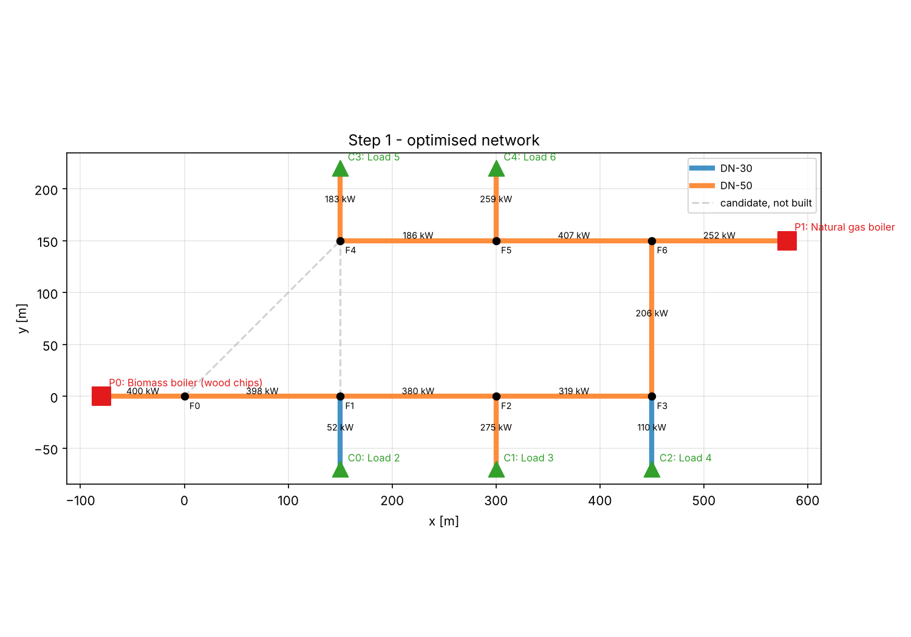
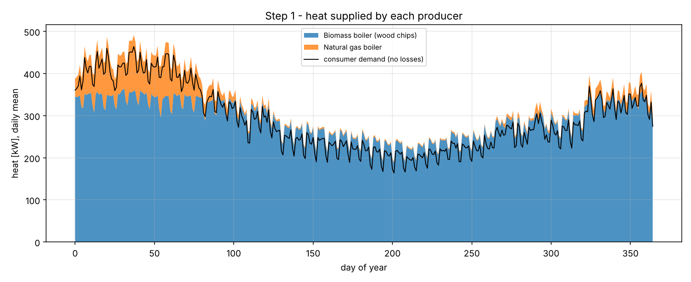

# Project2_MJ2505 – District Heating Network Optimization

KTH MJ2505, Project 2. DHNx (network design) + oemof.solph (energy system).

| Step | Script | Status |
|------|--------|--------|
| 1 – Base network (5 consumers, 2 producers, DN-30/DN-50) | `step1_base_network.py` | done |
| 2 – Expansion (10 consumers, 5 producers, 5 pipe types) | – | next |
| 3 – oemof dispatch of the 5 producers | – | |
| 4 – Add DHNx network losses to the oemof demand | – | |
| 5 – CO₂ cost scenarios | – | |

## How to run

```bash
pip install -r requirements.txt     # once
python step1_base_network.py        # ~1–2 minutes
```

The script writes:
- `inputs/step1/` – the DHNx input CSV files (network + investment options). Open them in Excel to see exactly what the model gets.
- `results/step1/` – result tables and plots (`network.png`, `producers.png`, `pipes_built.csv`, `key_results.csv`, ...).

**All assumed numbers are in one file: [`src/parameters.py`](src/parameters.py).** Each one has its unit and source next to it. Change a number there and rerun.

## Files

```
data/Demand_profiles_heating.xlsx   original course data (50 hourly profiles)
data/demand_profiles.csv            same data (Sheet1) as CSV, faster to read
src/parameters.py                   ALL assumptions (pipes, temperatures, costs, producers)
src/network_tools.py                writes DHNx inputs, runs DHNx, summarises results
src/plotting.py                     plots
src/compat.py                       two small fixes so DHNx 0.0.4 works with oemof.solph 0.6
step1_base_network.py               Step 1
```

---

## Step 1 – what the model does

### Inputs and assumptions

**Country:** Sweden (a suburb south of Stockholm; coordinates only used for plots).

**Units:** we assume the Excel profiles are in **kW** (hourly average, so 1 hour × kW = kWh).

**Consumers** – Loads 2–6. Most other columns in the Excel file are copies of
Loads 1–6 with a constant added (e.g. Load 8 = Load 2 + 300). Loads 2–6 are the
five different small profiles. Load 1 (2.6 MW peak) is far too large for a DN-50 pipe.

| Consumer | Profile | Peak [kW] | Yearly demand [MWh] | Character |
|---|---|---|---|---|
| C0 | Load 2 | 50 | 150 | small, strong winter peak |
| C1 | Load 3 | 273 | 614 | almost flat all year |
| C2 | Load 4 | 109 | 176 | small, seasonal |
| C3 | Load 5 | 182 | 1045 | flat base + winter peak |
| C4 | Load 6 | 258 | 557 | seasonal, ~0 in summer |
| **Total** | | **625 (coincident)** | **2542** | |

**Producers**

| | Technology | Variable cost [€/kWh heat] | Max output [kW] | Basis |
|---|---|---|---|---|
| P0 | Biomass boiler (wood chips) | 0.0264 | 400 | 22 €/MWh fuel / η 0.90 + 2 €/MWh O&M |
| P1 | Natural gas boiler | 0.0525 | 1000 | 50 €/MWh fuel / η 0.97 + 1 €/MWh O&M |

Fuel prices are typical Swedish levels (Energimyndigheten). Efficiencies and O&M come from the Danish Energy Agency technology catalogue. The biomass boiler is a base-load unit sized below the peak, so the gas boiler covers peaks. CO₂ costs are left out on purpose; they are added in Step 5.

**Pipes** (supply/return temperature 85/45 °C, so ΔT = 40 K)

| | Max velocity [m/s] | Capacity [kW] | Investment [€/m] | Annualised [€/(m·a)] | Heat loss [W/m] |
|---|---|---|---|---|---|
| DN-30 | 1.0 | 115 | 281 | 14.2 | 15 |
| DN-50 | 1.3 | 415 | 316 | 16.0 | 19 |

- Capacity = ρ · c_p · v_max · (π d²/4) · ΔT, with d = DN (simplification).
- Investment cost: Persson & Werner (2011), *Applied Energy* 88, 568–576: C = C1 + C2·d_a, suburban area (C1 = 214 €/m, C2 = 1725 €/m²).
- Annualised with a 4 % real interest rate over 40 years (annuity factor 0.0505).
- Heat loss: typical pre-insulated twin pipe, insulation series 2. The loss is constant all year because the water is always hot.

**Topology:** two parallel streets with two cross streets and a footpath, so DHNx can choose between several routes (dashed grey lines in `network.png` are candidate pipes that were *not* built).

### How the optimisation works (the "design problem")

DHNx builds an oemof.solph model:

- **Decision variables:** for every candidate street and every pipe type, *build it or not* (binary) and *its capacity* [kW]. Also the heat flow in every pipe and from every producer in every time step [kW].
- **Objective:** minimise yearly cost = Σ pipe annuity [€/a] + Σ heat production × variable cost [€/a]. Heat losses must be produced too, so losses cost money.
- **Constraints:**
  - Heat balance at every fork and consumer: what flows in = what flows out + demand.
  - Pipe flow ≤ capacity of the chosen pipe type.
  - Every built pipe loses a fixed heat amount (W/m × length).
  - Producer output ≤ its maximum.

**Two stages, so it solves in seconds rather than hours:**
1. **Design:** the network and pipe types are chosen using 12 *design hours*: each consumer's own peak hour, plus the hours with the highest total demand. Each design hour represents 730 h of the year.
2. **Operation:** the chosen pipes are fixed and the network is run for all 8760 hours. This gives the yearly losses, producer output and costs.

Solving all 8760 hours together with the build/don't-build decisions was tried. It had not finished after 10 minutes.

### Results



| | DN-30 | DN-50 | Total |
|---|---|---|---|
| Number of pipes | 2 | 11 | 13 |
| Length [m] | 140 | 1320 | 1460 |
| Investment [€] | 39 382 | 416 856 | 456 238 |
| Heat loss [MWh/a] | 18.4 | 219.7 | 238.1 |

| Key number | Value |
|---|---|
| Consumer demand | 2 542 MWh/a |
| Network heat losses | 238 MWh/a (8.6 % of heat supplied) |
| Biomass boiler | 2 544 MWh/a, peak 400 kW (at its limit) |
| Gas boiler | 236 MWh/a, peak 252 kW |
| Pipe annuity | 23 090 €/a |
| Operating cost | 79 570 €/a |
| Total yearly cost | 102 660 €/a |



### Answers to the Step 1 questions (draft, check and rewrite in your own words)

**How does the optimizer decide which pipe type to use?**
For each street it picks the *cheapest pipe type that can still carry the largest flow that street needs*. "Cheapest" means pipe annuity plus the cost of producing the heat the pipe loses. DN-30 is cheaper on both counts: 14.2 vs 16.0 €/(m·a) to build, and 15 vs 19 W/m lost, which is about 0.9 €/(m·a) less heat to produce. So DN-30 is chosen wherever the flow is below 115 kW, and DN-50 only where the flow is larger.

**Difference between the pipes (cost, losses, capacity)?**
DN-50 carries 3.6× more heat (415 vs 115 kW) but costs only 12 % more per metre and loses 27 % more heat. Per kW of capacity, the big pipe is much cheaper, but you pay for its full cost even when the flow is small.

**Why one type near the beginning of the network and another elsewhere?**
Near the producers, the pipes carry the heat for *many* consumers added together: 400 kW out of the biomass plant. Only DN-50 can carry that. At the ends of the network, a pipe only serves one house. C0 (52 kW) and C2 (110 kW) fit in DN-30, so DN-30 is used there. C1, C3 and C4 have peaks above 115 kW, so even their house connections need DN-50. Note that C2's DN-30 pipe runs at 96 % of its capacity in the peak hour.

**Topology:** the optimizer built a *branched* (tree) network and skipped the loop (F1–F4 and the F0–F4 footpath). A loop would give redundancy, but every extra metre costs money and loses heat. The optimizer only minimises cost, so it doesn't value reliability.

**Model limitations to mention:** fixed ΔT and velocity limits (no detailed hydraulics or pressure drop), d = DN simplification, heat loss independent of the actual flow, and pipe sizes chosen on 12 design hours (verified afterwards over all 8760 hours).
